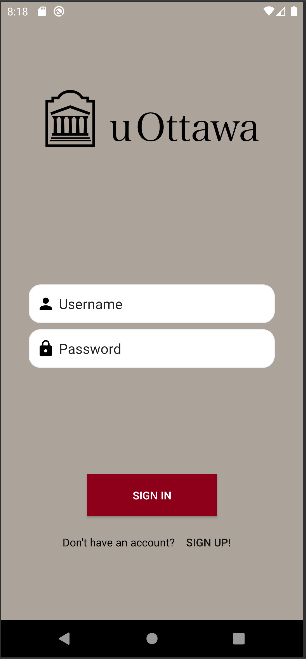
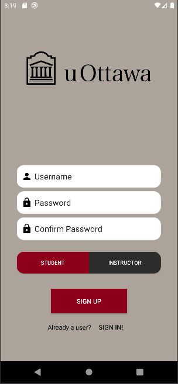
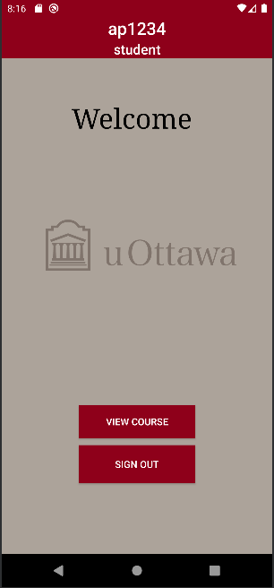
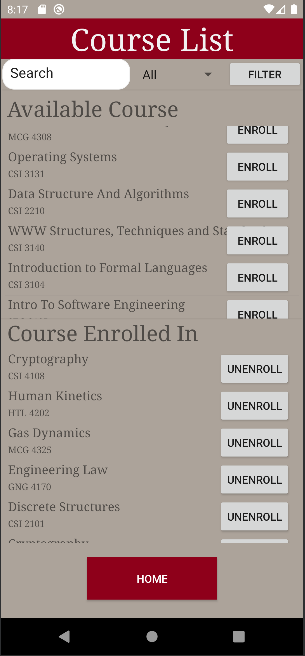
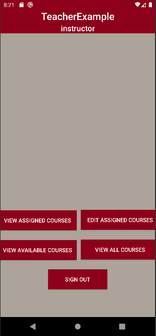
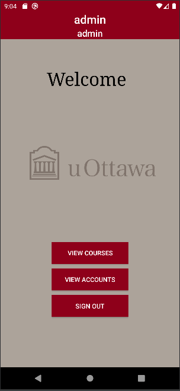
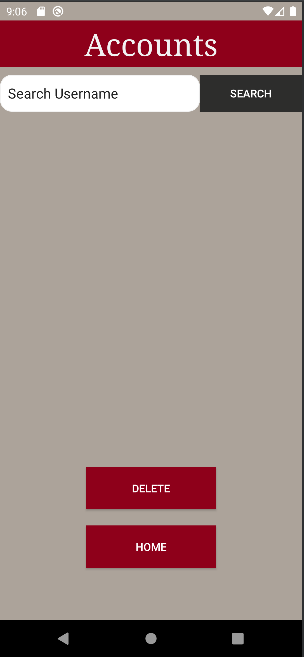
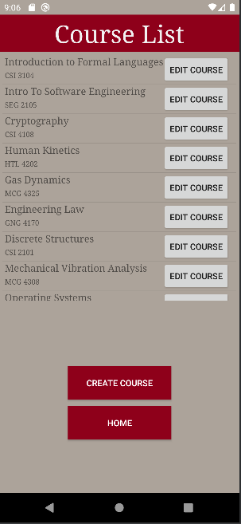

# Android Project: Student Course Booking App
## About The Project :blue_book:

This is an application made as part of the course Intro to Software Engineering at the University of Ottawa. The goal of this project is to implement, as a team, an android app. The application is a basic course selection service for students and instructors.
### A bit more details
The student course booking app is backed by Cloud Firestore and used Firebase Authentication. Cloud Firestore is a NoSQL database that the application used to store information regarding the users and the courses. We decided to use a NoSQL out of curiosity and quickly discover that the unstructured nature of the database was nice to work with at the beginning of the project but became a struggle. The NoSQL database led to a faster development time because we didn't have to define any structure. We could add a field as we progress however, this lead to complication toward the end of the project. Defining a structure at the beginning of the project and using a SQL database would have made the development easier toward the end. Anyhow, we learn a lot from the experience regarding databases and the development of Android apps using Android Studio. 

### Some pictures 

There are also additional pages ("activity") that weren't shown here.